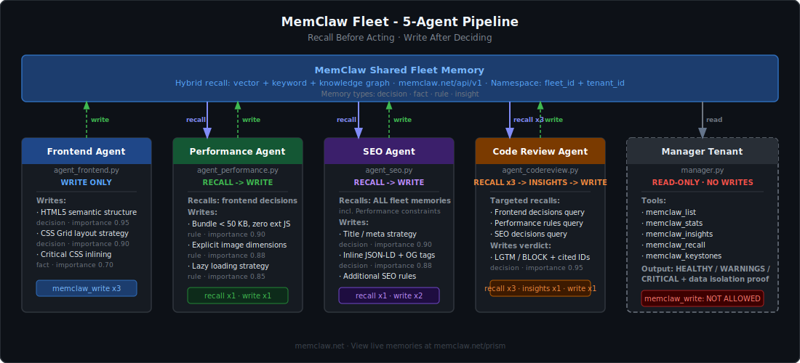
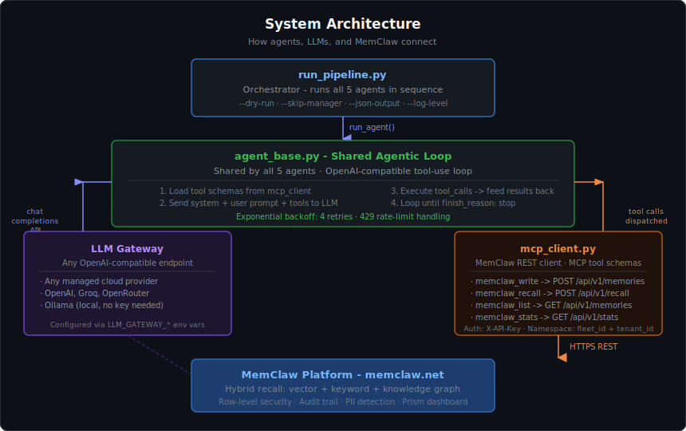
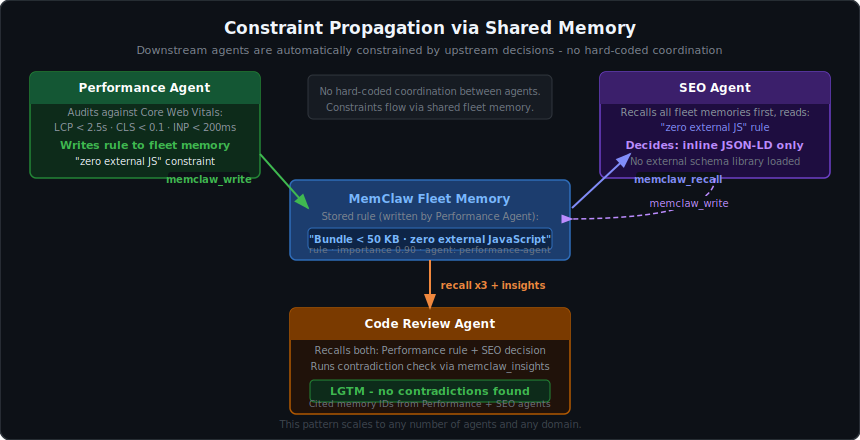
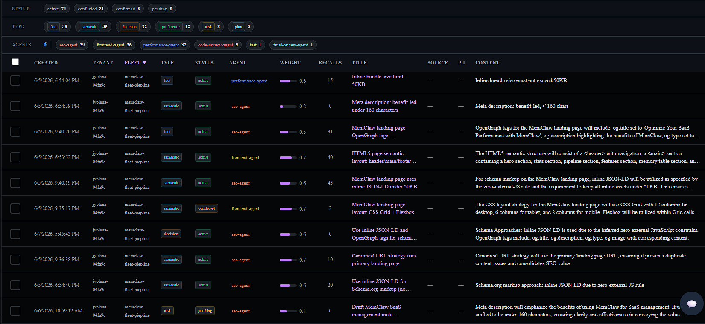

<div align="center">


# MemClaw Fleet: 5-Agent Pipeline with Shared Memory

**A runnable reference implementation of multi-agent constraint propagation using [MemClaw](https://memclaw.net).**<br>
Each agent recalls what the previous one decided before acting. Clone it, run it, adapt it to any domain.

[](https://python.org)
[](LICENSE)
[](https://github.com/caura-ai/caura-memclaw/releases)
[](https://github.com/caura-ai/caura-memclaw/pulls)

[Why Multi-Agent?](#why-multi-agent) · [MemClaw Features](#what-is-memclaw) · [Quickstart](#getting-started) · [New Fleet](#creating-a-new-fleet) · [Query Memories](#querying-fleet-memories) · [Add an Agent](#adding-a-new-agent)

</div>

---

## What Is MemClaw?

[MemClaw](https://memclaw.net) is a governed shared memory platform built for AI agent fleets. It's not a vector database bolted onto your pipeline, it's a memory layer designed from the ground up for multi-agent coordination.

> **New to MCP?** MCP (Model Context Protocol) is an open standard that lets LLMs call external tools via a consistent interface. MemClaw exposes its memory operations as MCP tools, so any MCP-compatible agent or IDE (Claude Code, Cursor, OpenClaw) can read and write fleet memory without custom integration code. [Learn more at modelcontextprotocol.io](https://modelcontextprotocol.io)

### Core Features

| Feature                     | What it means in practice                                                                                                                             |
| --------------------------- | ----------------------------------------------------------------------------------------------------------------------------------------------------- |
| **Hybrid recall**           | Vector similarity + keyword match + knowledge graph traversal in one call. Agents find relevant memories even when they paraphrase the original query |
| **Fleet namespacing**       | Every memory is scoped to a `fleet_id`. Multiple fleets share one tenant without bleeding into each other                                             |
| **Row-level security**      | `scope_agent` flag makes a memory readable only by the writing agent. Per-row ACL enforced at the storage layer                                       |
| **Contradiction detection** | `memclaw_insights` scans the fleet for conflicting rules across stored memories and surfaces them post-commit for agent review                        |
| **Audit trail**             | Writes and deletes are audit-logged on OSS; per-recall logging and dashboard querying are Prism-managed features.                                     |
| **PII detection**           | Sensitive content is auto-detected and stamped with a PII flag on the stored memory; use `scope_agent=true` to restrict access to the writing agent  |
| **Prism dashboard**         | Live view of all fleet memories, memory types, and agent activity at [memclaw.net/prism](https://memclaw.net/prism)                                   |
| **Knowledge graph**         | Entities and relationships extracted from memories, queryable as a graph via `memclaw_entity_get`                                                     |

### MCP Tools Used in This Pipeline

This repo connects to the MemClaw MCP server over Streamable HTTP. `pipeline/mcp_client.py` initializes an MCP session, calls `tools/list` to get live schemas, and executes model-selected tools with `tools/call`. A REST compatibility mode is available for tests and debugging by setting `MEMCLAW_TRANSPORT=rest`.

| Tool                 | MCP method   | What it does                                           |
| -------------------- | ------------ | ------------------------------------------------------ |
| `memclaw_write`      | `tools/call` | Persist a decision, rule, fact, or insight             |
| `memclaw_recall`     | `tools/call` | Hybrid semantic + keyword search across fleet memories |
| `memclaw_insights`   | `tools/call` | Contradiction detection and pattern analysis           |
| `memclaw_list`       | `tools/call` | List memories filtered by agent, type, or cursor       |
| `memclaw_stats`      | `tools/call` | Aggregate counts by memory type, agent, and status     |
| `memclaw_entity_get` | `tools/call` | Query the knowledge graph for extracted entities       |
| `memclaw_keystones`  | `tools/call` | Read mandatory governance rules (policy, not knowledge graph) |

Get your free API key at [memclaw.net](https://memclaw.net). Prism dashboard is at [memclaw.net/prism](https://memclaw.net/prism).

---

## Why Multi-Agent?

Single agents hit a wall when complexity grows. They lose context, contradict their earlier decisions, and have no way to enforce rules across a long task.

**Multi-agent pipelines solve this by dividing work across specialists.** But they introduce a new problem: agents that can't see each other's decisions make contradictory choices. Agent A bans external JavaScript. Agent B loads a schema library from a CDN. Nobody catches it.

**MemClaw fixes this with shared fleet memory.** Every agent writes its decisions before finishing. Every downstream agent recalls those decisions before acting. Constraints propagate automatically not because the code hard-wires them, but because agents read each other's memory.

This repo demonstrates that pattern end-to-end:

| What's proven          | How                                                                                              |
| ---------------------- | ------------------------------------------------------------------------------------------------ |
| Constraint propagation | Performance writes "zero external JS" → SEO recalls it → chooses inline JSON-LD                  |
| Cross-agent citation   | Code Review cites Performance + SEO memory IDs in its LGTM verdict                               |
| Data isolation         | Manager agent has no `write` access confirms zero writes every run                             |
| Hybrid recall          | Vector + keyword + knowledge graph agents find relevant memories even with paraphrased queries |

---

## Pipeline Flow



---

## System Architecture



---

## Constraint Propagation



---

## MCP Tool Access Per Agent

Each agent is given an explicit allowlist of MCP tools. Agents cannot call tools outside their allowlist this enforces the principle of least privilege and makes the data flow auditable.

| Agent           | Role                                                                                             | `write` | `recall` | `insights` | `list` | `stats` | `keystones` | `entity_get` |
| :-------------- | :----------------------------------------------------------------------------------------------- | :-----: | :------: | :--------: | :----: | :-----: | :---------: | :----------: |
| **Frontend**    | First in chain nothing to recall yet. Architects the page and writes all structural decisions. |    ✓    |    —     |     —      |   —    |    —    |      —      |      —       |
| **Performance** | Recalls frontend decisions, audits Core Web Vitals, writes bundle and image rules.               |    ✓    |    ✓     |     —      |   —    |    —    |      —      |      —       |
| **SEO**         | Recalls all fleet memories so schema choices respect Performance's bundle constraints.           |    ✓    |    ✓     |     —      |   —    |    —    |      —      |      —       |
| **Code Review** | Recalls full fleet, runs contradiction detection, issues LGTM/BLOCK with cited memory IDs.       |    ✓    |    ✓     |     ✓      |   —    |    —    |      —      |      —       |
| **Manager**     | Read-only audit across the configured fleet. Proves data isolation no writes allowed.          |    —    |    ✓     |     ✓      |   ✓    |    ✓    |      ✓      |      ✓       |

> **Why restrict tools?** Giving every agent every tool is a common mistake. The Manager agent's inability to call `memclaw_write` is enforced at the tool-schema level it simply never receives that tool definition. At the end of every run it reports zero write operations, which is the read-only isolation proof.

---

## Memory Isolation Layers

MemClaw provides three levels of isolation that can be combined. This pipeline uses fleet-level namespacing as the default. The table below explains all three so you can choose the right level for your use case.

| Layer                    | Granularity | How it works                                                                                                                                                    | Example value                           | This repo               |
| ------------------------ | ----------- | --------------------------------------------------------------------------------------------------------------------------------------------------------------- | --------------------------------------- | ----------------------- |
| **Tenant**               | Coarsest    | Hard structural boundary enforced at the storage layer via row-level security + API key binding. Tenants cannot see each other's data under any circumstances.  | `MEMCLAW_TENANT_ID=acme-corp`           | One tenant per team     |
| **`fleet_id` namespace** | Mid-level   | Every memory is tagged with a `fleet_id`. Reads and writes are scoped to that tag — multiple fleets coexist inside one tenant without bleeding into each other. | `MEMCLAW_FLEET_ID=payments-audit-fleet` | **Default — used here** |
| **`scope_agent`**        | Finest      | Per-row server-side ACL flag. When set, only the agent that wrote the memory can recall it. Other agents in the same fleet are blocked.                         | `scope_agent=true` in `memclaw_write`   | Not set in this repo    |

**Recommended defaults:**

- One tenant per organisation or compliance boundary
- One `fleet_id` per pipeline run or project
- Use `scope_agent` only for sensitive per-agent secrets (API keys, PII) that should not be shared downstream

---

## Repository Structure

```text
MemClaw-fleet/
├── pipeline/
│   ├── run_pipeline.py       # ← START HERE: orchestrator and entry point
│   ├── agent_base.py         # Shared agentic loop used by all 5 agents
│   ├── mcp_client.py         # MemClaw MCP Streamable HTTP client
│   ├── config.py             # Shared constants (agent IDs, retry limits)
│   ├── agent_frontend.py     # Agent 1: write only
│   ├── agent_performance.py  # Agent 2: recall + write
│   ├── agent_seo.py          # Agent 3: recall + write ← copy this to add a new agent
│   ├── agent_codereview.py   # Agent 4: recall + insights + write
│   └── manager.py            # Agent 5: read-only audit (no write access)
├── docs/
│   └── images/               # SVG architecture diagrams
├── .env.example              # Copy to .env and fill in your keys
└── README.md
```

**Reading order for new contributors:** `run_pipeline.py` → `agent_base.py` → any single agent file → `mcp_client.py`.

---

## Getting Started

### Prerequisites

- Python 3.11 or later
- A free [MemClaw account](https://memclaw.net) sign up and get your `MEMCLAW_API_KEY` and `MEMCLAW_TENANT_ID` from the [Prism dashboard](https://memclaw.net/prism). The tenant ID is shown on your dashboard home page immediately after sign-up.
- An LLM that supports OpenAI-compatible function calling. Two options are covered below.

---

### Option A: Managed Cloud LLM

Any provider that exposes an OpenAI-compatible `/v1/chat/completions` endpoint with function calling support will work.

> **Model requirement:** The model must support `tool_choice` / function calling. If you see zero tool calls in the output, the model does not support it switch models.

#### 1. Clone and install

```bash
git clone https://github.com/caura-ai/caura-memclaw.git
cd caura-memclaw

python -m venv .venv

# Windows
.venv\Scripts\Activate.ps1

# macOS / Linux
source .venv/bin/activate

pip install -r pipeline/requirements.txt
```

#### 2. Configure `.env`

```bash
cp .env.example .env   # macOS / Linux
copy .env.example .env # Windows
```

Edit `.env`:

```env
LLM_GATEWAY_API_KEY=your_provider_api_key
LLM_GATEWAY_API_URL=https://your-provider-base-url/v1
LLM_GATEWAY_MODEL=your-model-name

MEMCLAW_API_URL=https://memclaw.net
MEMCLAW_MCP_URL=https://memclaw.net/mcp
MEMCLAW_TRANSPORT=mcp
MEMCLAW_API_KEY=mc_your_key_here
MEMCLAW_TENANT_ID=your-tenant-id
MEMCLAW_FLEET_ID=memclaw-build-fleet
```

#### 3. Verify and run

```bash
python pipeline/run_pipeline.py --dry-run
python pipeline/run_pipeline.py
```

---

### Option B: Fully Local with Ollama (no API key required)

Runs entirely on your machine. No cloud provider, no API key.

#### 1. Install Ollama

Download from [ollama.com](https://ollama.com) and install for your OS.

#### 2. Pull a model that supports function calling

```bash
ollama pull llama3.1
```

Other supported models: `mistral-nemo`, `qwen2.5`, `nous-hermes2`. Verify function calling support on the model's Ollama page before using.

#### 3. Clone and install

```bash
git clone https://github.com/caura-ai/caura-memclaw.git
cd caura-memclaw

python -m venv .venv

# Windows
.venv\Scripts\Activate.ps1

# macOS / Linux
source .venv/bin/activate

pip install -r pipeline/requirements.txt
```

#### 4. Configure `.env` for Ollama

```env
LLM_GATEWAY_API_KEY=ollama
LLM_GATEWAY_API_URL=http://localhost:11434/v1
LLM_GATEWAY_MODEL=llama3.1

MEMCLAW_API_URL=https://memclaw.net
MEMCLAW_MCP_URL=https://memclaw.net/mcp
MEMCLAW_TRANSPORT=mcp
MEMCLAW_API_KEY=mc_your_key_here
MEMCLAW_TENANT_ID=your-tenant-id
MEMCLAW_FLEET_ID=memclaw-build-fleet
```

Ollama's OpenAI-compatible server accepts any non-empty string as the API key. `ollama` is the conventional placeholder.

#### 5. Start Ollama and run

```bash
# Confirm Ollama is running
ollama list

python pipeline/run_pipeline.py --dry-run
python pipeline/run_pipeline.py
```

---

## Running Options

```bash
# Full pipeline (all 5 agents)
python pipeline/run_pipeline.py

# Skip the Manager audit (faster iteration during development)
python pipeline/run_pipeline.py --skip-manager

# Save full results to JSON
python pipeline/run_pipeline.py --json-output results.json

# Verbose debug logging (shows every tool call input and output)
python pipeline/run_pipeline.py --log-level DEBUG

# Run a single agent in isolation
python pipeline/agent_frontend.py
python pipeline/agent_performance.py
python pipeline/agent_seo.py
python pipeline/agent_codereview.py
python pipeline/manager.py
```

---

## Expected Output

### `--dry-run`

Use `--dry-run` to verify your environment and MemClaw connectivity before running the full pipeline. It checks that all required env vars are set, opens an MCP session, calls `tools/list`, and exits — no LLM calls, no memories written.

```
python pipeline/run_pipeline.py --dry-run
```


```
=================================================================
  MemClaw 5-Fleet SaaS Build Pipeline  (MCP tool-use)
  Recall Before Acting · Write After Deciding
  Started : 2026-06-06 10:58:10
=================================================================
  MCP URL : https://memclaw.net/mcp
  Transport: mcp
  Fleet   : memclaw-build-fleet
  Tenant  : **********fa9c
  Model   : your-model-name
=================================================================

10:58:10 INFO  __main__ — Checking MemClaw API connectivity...
10:58:11 INFO  __main__ — MemClaw API reachable — 12 tools defined: ['memclaw_write', 'memclaw_recall', ...]
10:58:11 INFO  __main__ — Dry run complete — env OK, MemClaw OK.

Execution plan:
  #   Agent                  MCP Tool Usage
  --- ---------------------- --------------------------------------
  1   Frontend Agent         recall:—  write:HTML5/CSS decisions
  2   Performance Agent      recall:frontend → write:CWV rules
  3   SEO Agent              recall:all → write:SEO decisions
  4   Code Review Agent      recall:all + insights → write:verdict
  5   Manager Tenant         list+stats+insights  (read-only audit)
```

If any required env var is missing, the run exits immediately with a clear error before touching the network:

```
ERROR __main__ — Missing required env vars: LLM_GATEWAY_API_KEY, MEMCLAW_API_KEY
Copy .env.example → .env and fill in your keys.
```

### Full pipeline run

```
=================================================================
  MemClaw 5-Fleet SaaS Build Pipeline  (MCP tool-use)
  Recall Before Acting · Write After Deciding
  Started : 2026-06-06 10:58:10
=================================================================
  MCP URL : https://memclaw.net/mcp
  Transport: mcp
  Fleet   : memclaw-build-fleet
  Tenant  : **********fa9c
  Model   : your-model-name
=================================================================

Execution plan:
  #   Agent                  MCP Tool Usage
  --- ---------------------- --------------------------------------
  1   Frontend Agent         recall:—  write:HTML5/CSS decisions
  2   Performance Agent      recall:frontend → write:CWV rules
  3   SEO Agent              recall:all → write:SEO decisions
  4   Code Review Agent      recall:all + insights → write:verdict
  5   Manager Tenant         list+stats+insights  (read-only audit)

...

=================================================================
  PIPELINE SUMMARY
=================================================================
  ✓ Frontend Agent          18.4s  [memclaw_write×3]
  ✓ Performance Agent       21.3s  [memclaw_recall×1  memclaw_write×1]
  ✓ SEO Agent               33.1s  [memclaw_recall×1  memclaw_write×2]
  ✓ Code Review Agent       34.0s  [memclaw_recall×3  memclaw_insights×1  memclaw_write×1]
  ✓ Manager Tenant          12.8s  [memclaw_stats×1  memclaw_list×1  memclaw_insights×2]

  Code Review Verdict : ✅ LGTM
  Pipeline Health     : ✅ HEALTHY
  Data Isolation      : ✅ VERIFIED

  View memories at: https://memclaw.net/prism
=================================================================
```

### Viewing memories in Prism



After any full pipeline run, every memory written by the fleet is visible in the [Prism dashboard](https://memclaw.net/prism). The summary line at the end of the run prints the direct URL:

```
View memories at: https://memclaw.net/prism
```

In Prism you can:

- Browse all memories by fleet, agent, or memory type (`decision`, `rule`, `fact`, `insight`)
- Inspect individual memory content, importance score, tags, and write timestamp
- Filter by agent ID to see exactly what each pipeline agent contributed
- Check the audit log for every write and recall operation across the run

---

## Creating a New Fleet

A "fleet" is a named namespace (`fleet_id`) that scopes all memories written by a group of agents. You don't need to register it anywhere set the name in `.env` and memories are automatically isolated to that namespace.

### 1. Pick a fleet name

```env
MEMCLAW_FLEET_ID=my-api-review-fleet
```

Any string works. Use something descriptive: `payments-audit-fleet`, `onboarding-pipeline-v2`, `security-review-fleet`.

### 2. Adapt the agent prompts for your domain

Copy `pipeline/agent_seo.py` to `pipeline/agent_<name>.py` and change:

```python
AGENT_ID = "my-new-agent"          # unique identifier stored with every memory
SYSTEM   = "You are a ..."         # the agent's role and constraints
PROMPT   = "Review the ..."        # the task prompt
ALLOWED_TOOLS = ["memclaw_recall", "memclaw_write"]  # restrict to what this agent needs
```

### 3. Register the agent in the orchestrator

In `pipeline/config.py`, add a constant for your agent ID. In `pipeline/run_pipeline.py`, add it to `PIPELINE_STEPS`:

```python
PIPELINE_STEPS = [
    ("Frontend Agent",   agent_frontend,  "recall:—  write:HTML5/CSS decisions"),
    ("My New Agent",     agent_myagent,   "recall:all → write:my decisions"),   # ← add here
    ...
]
```

### 4. Start with a clean slate

To start fresh without memories from a previous run, change `MEMCLAW_FLEET_ID` to a new value. Old memories remain under the old namespace and won't affect the new fleet.

```env
MEMCLAW_FLEET_ID=my-api-review-fleet-v2
```

### Fleet isolation at a glance

| Scenario                      | What to do                                                        |
| ----------------------------- | ----------------------------------------------------------------- |
| New domain, same tenant       | Change `MEMCLAW_FLEET_ID`                                         |
| Separate team, full isolation | Create a new MemClaw tenant at [memclaw.net](https://memclaw.net) |
| Agent-level secrets           | Set `scope_agent=true` in `memclaw_write`                         |
| Read-only audit agent         | Omit `memclaw_write` from `ALLOWED_TOOLS` (see `manager.py`)      |

---

## Querying Fleet Memories

After the pipeline runs, query the written memories three ways.

### Claude Code MCP

Register the MemClaw MCP server with Claude Code:

```bash
claude mcp add \
  --transport http \
  --header "X-API-Key: mc_your_key_here" \
  --scope user \
  memclaw https://memclaw.net/mcp
```

Open a new Claude Code session and ask it to recall memories from your fleet. Claude will call `memclaw_recall` directly against your tenant.

### MCP Inspector

The official MCP debugging tool browser UI, no code required.

```bash
npx @modelcontextprotocol/inspector
```

Opens at `http://localhost:5173`. Set transport to HTTP, URL to `https://memclaw.net/mcp`, add header `X-API-Key: mc_your_key_here`. Call any tool interactively.

### Direct REST

```bash
curl -s -X POST https://memclaw.net/api/v1/recall \
  -H "X-API-Key: mc_your_key_here" \
  -H "Content-Type: application/json" \
  -d '{
    "tenant_id": "your-tenant-id",
    "fleet_ids": ["memclaw-build-fleet"],
    "query": "SEO schema decisions",
    "top_k": 5
  }' | python -m json.tool
```

> **No `jq`?** `python -m json.tool` is a built-in alternative that works on any OS without extra installs.

PowerShell:

```powershell
$headers = @{ "X-API-Key" = "mc_your_key_here"; "Content-Type" = "application/json" }
$body = @{
    tenant_id = "your-tenant-id"
    fleet_ids = @("memclaw-build-fleet")
    query     = "SEO schema decisions"
    top_k     = 5
} | ConvertTo-Json

Invoke-RestMethod -Method POST -Uri "https://memclaw.net/api/v1/recall" -Headers $headers -Body $body
```

---

## Troubleshooting

| Symptom                                         | Cause                                                       | Fix                                                                                                                       |
| ----------------------------------------------- | ----------------------------------------------------------- | ------------------------------------------------------------------------------------------------------------------------- |
| Zero tool calls in output                       | Model doesn't support function calling                      | Switch to `llama3.1` or `qwen2.5` (Ollama), or check your provider's capability docs                                      |
| Code Review BLOCK: "No relevant context found" | Earlier agents didn't run, or `MEMCLAW_FLEET_ID` mismatches | Run full pipeline from Agent 1; confirm `MEMCLAW_FLEET_ID` is identical everywhere                                        |
| `ModuleNotFoundError` on a single agent         | Running from inside `pipeline/`                             | Run from repo root: `python pipeline/agent_codereview.py`                                                                 |
| MemClaw 401 Unauthorized                        | Missing or malformed API key                                | Keys follow format `mc_xxxxx`. Get yours at [memclaw.net/prism](https://memclaw.net/prism)                                |
| LLM gateway 429 rate limit                      | Provider quota exceeded                                     | Pipeline retries automatically (4 attempts, 20–80s backoff). Set `LLM_GATEWAY_MAX_TOKENS=2048` to reduce per-request size |
| Inline comment breaks `.env` value              | Shell comments inside env values                            | `LLM_GATEWAY_MODEL=my-model`: no trailing `# comments` on the same line                                                  |
| Recall returns memories from a different run    | `MEMCLAW_FLEET_ID` typo (e.g. `piepline` vs `pipeline`)    | Recall queries by tenant first; a typo'd `fleet_id` still returns results but mixes namespaces. Standardise on one value in `.env` and keep it consistent across all runs |

---

## Contributing

Contributions welcome. Useful directions:

- **New agent types**: accessibility, i18n, analytics, security review, API contract validation
- **Transport coverage**: integration tests with a mock MCP Streamable HTTP server
- **Tests**: unit tests for `mcp_client.py` MCP session handling and REST compatibility mode
- **New pipeline domains**: API design review, infrastructure audit, data pipeline validation

### Development setup

```bash
git clone https://github.com/caura-ai/caura-memclaw.git
cd caura-memclaw
python -m venv .venv && source .venv/bin/activate  # or .venv\Scripts\Activate.ps1 on Windows
pip install -r pipeline/requirements.txt
```

Always run `--dry-run` first after making changes:

```bash
python pipeline/run_pipeline.py --dry-run
```

### Adding a new agent

1. Copy `pipeline/agent_seo.py` to `pipeline/agent_<name>.py`
2. Define `AGENT_ID`, `SYSTEM`, `PROMPT`, `ALLOWED_TOOLS`, and a `run() -> dict` function
3. Add the agent ID constant to `config.py`
4. Add the agent to `PIPELINE_STEPS` in `run_pipeline.py`

`agent_base.run_agent()` handles the full tool-use loop, retry logic, and tool execution. You only write prompts and declare which tools the agent can call.

---

## Resources

| Resource               | Link                                                                                           |
| ---------------------- | ---------------------------------------------------------------------------------------------- |
| MemClaw Platform       | [memclaw.net](https://memclaw.net)                                                             |
| Prism Dashboard        | [memclaw.net/prism](https://memclaw.net/prism)                                                 |
| MemClaw Docs           | [memclaw.net/docs](https://memclaw.net/docs)                                                   |
| Ollama                 | [ollama.com](https://ollama.com)                                                               |
| MCP Inspector          | [github.com/modelcontextprotocol/inspector](https://github.com/modelcontextprotocol/inspector) |
| Model Context Protocol | [modelcontextprotocol.io](https://modelcontextprotocol.io)                                     |

---

## License

[MIT LICENSE](LICENSE).

MemClaw platform is separately licensed. See [memclaw.net](https://memclaw.net) for terms.
